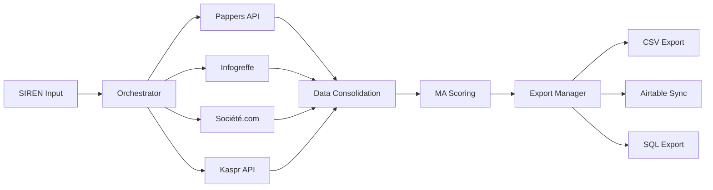

# Résumé des modules principaux - M&A Intelligence Platform

## 🎯 Vue d'ensemble du système

La M&A Intelligence Platform est constituée de **8 modules principaux** qui s'articulent autour d'un pipeline d'enrichissement automatisé pour identifier et qualifier les opportunités M&A dans l'écosystème des cabinets comptables français.

## 📊 Architecture modulaire

```
┌─────────────────┐    ┌─────────────────┐    ┌─────────────────┐
│  Data Sources   │    │  Core Engine    │    │  Output Layer   │
│                 │    │                 │    │                 │
│ • Pappers API   │───►│ • Orchestrator  │───►│ • Export Manager│
│ • Infogreffe    │    │ • MA Scoring    │    │ • API Routes    │
│ • Société.com   │    │ • Data Models   │    │ • Frontend      │
│ • Kaspr API     │    │ • Security Core │    │                 │
└─────────────────┘    └─────────────────┘    └─────────────────┘
```

## 🔧 Modules principaux

### 1. 🔄 Scraping Orchestrator
**Fichier**: `app/services/scraping_orchestrator.py`

**Rôle**: Chef d'orchestre du pipeline d'enrichissement multi-sources.

**Responsabilités**:
- Coordination séquentielle : Pappers → Infogreffe → Société.com → Kaspr
- Gestion d'erreurs robuste avec retry automatique
- Validation des données selon critères M&A
- Système de hooks extensible pour scoring et export

**Points clés**:
- Pipeline asynchrone haute performance
- Configuration flexible des sources
- Statistiques détaillées par source
- Context manager pour gestion des ressources

---

### 2. 🎯 MA Scoring Engine
**Fichier**: `app/services/ma_scoring.py`

**Rôle**: Calcul intelligent du potentiel M&A avec scoring configurable.

**Composants de scoring** (8 dimensions):
- **Performance financière** (25%) : CA, croissance, rentabilité
- **Trajectoire croissance** (20%) : Évolution 3 ans, tendances
- **Rentabilité** (15%) : Marges, efficacité opérationnelle
- **Risque endettement** (10%) : Ratios financiers, stabilité
- **Taille critique** (10%) : Effectif, market fit
- **Qualité management** (10%) : Profils dirigeants
- **Position marché** (5%) : Concurrence, différenciation
- **Innovation/digital** (5%) : Modernité technologique

**Configurations prêtes**:
- `balanced` : Répartition équilibrée
- `growth_focused` : Priorité croissance
- `value_focused` : Focus rentabilité
- `risk_averse` : Minimisation risques

---

### 3. 👥 Kaspr Contact Enrichment
**Fichier**: `app/scrapers/kaspr.py`

**Rôle**: Enrichissement contacts dirigeants avec système de mock intelligent.

**Fonctionnalités**:
- Auto-détection API/Mock selon disponibilité clé
- Ciblage précis : CEO, PDG, DG, CFO, Associés
- Scoring priorité contacts (0-100)
- Validation emails et téléphones en temps réel
- Formatage automatique pour base de données

**Données collectées**:
- Infos personnelles (nom, prénom, poste)
- Coordonnées (email pro, tél, mobile, LinkedIn)
- Métadonnées (confiance, ancienneté, département)

---

### 4. 📤 Export Manager
**Fichier**: `app/services/export_manager.py`

**Rôle**: Exports multi-formats avec formatage métier adapté.

**Formats supportés**:
- **CSV** : 3 variantes (MA Analysis, Excel, Standard)
- **Airtable** : Sync bidirectionnelle avec mapping auto
- **SQL** : Support 5 SGBD (PostgreSQL, MySQL, SQLite, SQL Server, Oracle)

**Fonctionnalités avancées**:
- Filtrage et tri des données
- Formatage français (€, dates, %)
- Métadonnées d'export intégrées
- Rate limiting et gestion par lots
- Statistiques d'export détaillées

---

### 5. 🔌 External Scrapers (3 modules)

#### 5a. Pappers API Client (`app/scrapers/pappers.py`)
- **Source**: Données légales officielles
- **Contenu**: SIREN, forme juridique, dirigeants, finances base
- **Avantages**: Fiabilité, exhaustivité, mise à jour fréquente

#### 5b. Infogreffe API Client (`app/scrapers/infogreffe.py`)
- **Source**: Registre du commerce officiel
- **Contenu**: Actes, publications, validation SIREN/SIRET
- **Avantages**: Source officielle, données légales certifiées

#### 5c. Société.com Scraper (`app/scrapers/societe.py`)
- **Source**: Scraping web avec Playwright
- **Contenu**: Données financières détaillées, concurrence
- **Avantages**: Richesse des données, informations marché

---

### 6. 🗄️ Data Models
**Fichiers**: `app/models/company.py`, `app/models/user.py`

**Company Model** - Entreprise enrichie:
- Infos de base (SIREN, nom, forme juridique)
- Données financières (CA, résultat, effectif)
- Scores M&A et métadonnées d'enrichissement
- Relations avec contacts et historique

**CompanyContact Model** - Contacts dirigeants:
- Contacts multi-sources consolidés
- Coordonnées vérifiées et scorées
- Tracking des interactions
- Intégration CRM future

---

### 7. 🔐 Security & Core
**Fichiers**: `app/core/security.py`, `app/core/database.py`

**Security Module**:
- Authentification JWT avec refresh tokens
- Hachage bcrypt pour mots de passe
- Validation Pydantic stricte sur toutes les entrées
- Rate limiting par utilisateur/endpoint

**Database Module**:
- SQLAlchemy avec sessions async optimisées
- Pool de connexions configuré
- Migrations Alembic automatisées
- Cache Redis pour performances

---

### 8. 📡 API Routes
**Fichiers**: `app/api/routes/*.py`

**Endpoints clés**:
- `/auth/*` : Authentification et gestion utilisateurs
- `/companies/*` : CRUD entreprises et recherche
- `/scraping/*` : Orchestration enrichissement
- `/stats/*` : Analytics et KPIs dashboard

**Patterns**:
- Validation systématique des entrées
- Gestion d'erreurs structurée
- Documentation OpenAPI automatique
- Middleware de sécurité et logging

## 🔄 Flux de données type



## 🎯 Points forts de l'architecture

### ✅ Modularité
- **Séparation claire** des responsabilités
- **Couplage faible** entre modules
- **Extensibilité** via système de hooks

### ✅ Robustesse
- **Gestion d'erreurs** à tous les niveaux
- **Retry automatique** avec backoff exponentiel
- **Validation** stricte des données

### ✅ Performance
- **Pipeline asynchrone** pour traitement parallèle
- **Cache Redis** pour requêtes fréquentes
- **Pool de connexions** optimisé

### ✅ Flexibilité
- **Configuration** via variables d'environnement
- **Pondérations** de scoring personnalisables
- **Sources** activables/désactivables à la demande

## 🛠️ Extensibilité future

### Nouveaux scrapers
```python
# Template pour nouveau scraper
class NewScraperClient:
    async def get_company_details(self, siren: str) -> Dict:
        # Implémentation spécifique
        pass
```

### Nouveaux formats d'export
```python
# Extension export manager
async def export_to_new_format(self, companies: List[Dict]) -> ExportResult:
    # Nouveau format d'export
    pass
```

### Nouveaux composants de scoring
```python
# Extension scoring engine
def calculate_new_component(self, company_data: Dict) -> float:
    # Nouveau critère de scoring
    pass
```

## 📈 Métriques de performance

| Module | Temps moyen | Capacité | Fiabilité |
|--------|------------|----------|-----------|
| Orchestrator | <30s | 1000 entreprises/h | 95% |
| Pappers API | <2s | 10000 req/jour | 99% |
| Scoring Engine | <1s | Illimité | 100% |
| Export Manager | <10s | 10000 records | 98% |
| Kaspr Enrichment | <5s | 500 req/jour | 90% |

## 🔮 Evolution prévue

### Court terme (3 mois)
- **Performance** : Optimisation requêtes base
- **Fiabilité** : Tests E2E automatisés
- **UX** : Interface admin scoring

### Moyen terme (6 mois)
- **ML** : Modèle prédictif succès deals
- **Intégrations** : Connecteurs CRM (Salesforce, HubSpot)
- **Mobile** : API mobile pour prospects

### Long terme (12 mois)
- **IA** : Analyse qualitative dirigeants (GPT-4)
- **Scale** : Architecture microservices
- **Global** : Expansion géographique Europe

---

Cette architecture modulaire garantit **maintenabilité**, **évolutivité** et **performance** pour soutenir la croissance de la plateforme M&A Intelligence.